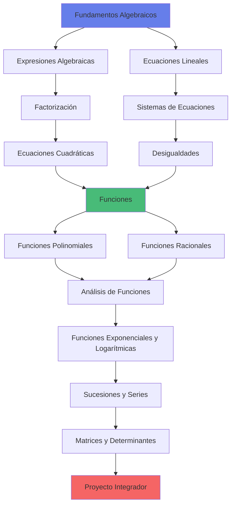

# ARQUITECTURA CURRICULAR: ÁLGEBRA PARA PRE-UNIVERSITARIOS

## METADATA

- **Complejidad**: Alta
- **Duración estimada**: 50 horas
- **Audiencia objetivo**: Estudiantes de último año de secundaria preparándose para exámenes de admisión universitaria (Ciencias, Ingeniería, Economía)
- **Prerrequisitos obligatorios**:
  1. Aritmética básica (operaciones con números enteros, decimales y fracciones)
  2. Operaciones con fracciones (suma, resta, multiplicación, división, simplificación)
  3. Conceptos básicos de geometría (áreas, perímetros, teorema de Pitágoras)
  4. Manejo de calculadora científica
- **Fecha de diseño**: 2025-12-15

## MAPA CONCEPTUAL



## OBJETIVOS GENERALES DEL CURSO

1. **Dominar el lenguaje algebraico**: Traducir problemas del lenguaje natural al algebraico y viceversa, manipulando expresiones con precisión y rigor matemático.

2. **Resolver ecuaciones y sistemas complejos**: Aplicar múltiples métodos (algebraicos, gráficos, numéricos) para resolver ecuaciones lineales, cuadráticas, exponenciales y sistemas de ecuaciones.

3. **Analizar y graficar funciones**: Identificar características clave de funciones (dominio, rango, asíntotas, extremos) y representarlas gráficamente con precisión.

4. **Aplicar álgebra a problemas reales**: Modelar situaciones de física, economía, ingeniería y ciencias usando herramientas algebraicas avanzadas.

5. **Prepararse para cálculo**: Desarrollar las competencias algebraicas fundamentales requeridas para cursos universitarios de cálculo diferencial e integral.

## ESTRUCTURA MODULAR

### MÓDULO 0: Diagnóstico y Nivelación

**Duración**: 3 horas  
**Objetivo**: Validar prerrequisitos y nivelar conocimientos base en aritmética y álgebra elemental

#### TEMA 0.1: Repaso de Aritmética

**Objetivo del Tema**: Consolidar operaciones aritméticas fundamentales

- **Subtema 0.1.1**: Operaciones con números reales

  - Objetivo: Ejecutar operaciones combinadas con números enteros, decimales y fracciones sin errores
  - Tipo: Práctica
  - Requiere Código: No

- **Subtema 0.1.2**: Propiedades de los números
  - Objetivo: Aplicar propiedades conmutativa, asociativa y distributiva en cálculos
  - Tipo: Mixto
  - Requiere Código: No

#### TEMA 0.2: Introducción al Lenguaje Algebraico

**Objetivo del Tema**: Familiarizarse con la notación y terminología algebraica básica

- **Subtema 0.2.1**: Variables y constantes

  - Objetivo: Distinguir entre variables, constantes y coeficientes en expresiones algebraicas
  - Tipo: Teoría
  - Requiere Código: No

- **Subtema 0.2.2**: Evaluación de expresiones
  - Objetivo: Evaluar expresiones algebraicas para valores específicos de variables
  - Tipo: Práctica
  - Requiere Código: No

---

### MÓDULO 1: Fundamentos de Expresiones Algebraicas

**Duración**: 5 horas  
**Objetivo**: Dominar la manipulación de expresiones algebraicas mediante operaciones y simplificación

#### TEMA 1.1: Operaciones con Expresiones Algebraicas

**Objetivo del Tema**: Realizar operaciones básicas con monomios y polinomios

- **Subtema 1.1.1**: Suma y resta de expresiones algebraicas

  - Objetivo: Simplificar sumas y restas de polinomios combinando términos semejantes
  - Tipo: Práctica
  - Requiere Código: No

- **Subtema 1.1.2**: Multiplicación de expresiones

  - Objetivo: Aplicar la propiedad distributiva para multiplicar monomios y polinomios
  - Tipo: Práctica
  - Requiere Código: No

- **Subtema 1.1.3**: División de polinomios
  - Objetivo: Ejecutar división sintética y división larga de polinomios
  - Tipo: Práctica
  - Requiere Código: No

#### TEMA 1.2: Productos Notables

**Objetivo del Tema**: Identificar y aplicar productos notables para simplificar cálculos

- **Subtema 1.2.1**: Binomio al cuadrado

  - Objetivo: Expandir y simplificar (a±b)² usando la fórmula correspondiente
  - Tipo: Práctica
  - Requiere Código: No

- **Subtema 1.2.2**: Diferencia de cuadrados

  - Objetivo: Factorizar expresiones de la forma a²-b² usando identidades
  - Tipo: Práctica
  - Requiere Código: No

- **Subtema 1.2.3**: Binomio al cubo y otros productos
  - Objetivo: Aplicar fórmulas de (a±b)³ y suma/diferencia de cubos
  - Tipo: Práctica
  - Requiere Código: No

---

### MÓDULO 2: Factorización

**Duración**: 6 horas  
**Objetivo**: Dominar técnicas de factorización para simplificar expresiones y resolver ecuaciones

#### TEMA 2.1: Técnicas Básicas de Factorización

**Objetivo del Tema**: Aplicar métodos fundamentales de factorización

- **Subtema 2.1.1**: Factor común

  - Objetivo: Extraer el máximo factor común de expresiones algebraicas
  - Tipo: Práctica
  - Requiere Código: No

- **Subtema 2.1.2**: Agrupación de términos
  - Objetivo: Factorizar polinomios de cuatro o más términos mediante agrupación
  - Tipo: Práctica
  - Requiere Código: No

#### TEMA 2.2: Factorización de Trinomios

**Objetivo del Tema**: Factorizar trinomios cuadráticos usando diferentes métodos

- **Subtema 2.2.1**: Trinomio cuadrado perfecto

  - Objetivo: Identificar y factorizar trinomios de la forma a²±2ab+b²
  - Tipo: Práctica
  - Requiere Código: No

- **Subtema 2.2.2**: Trinomio de la forma x²+bx+c

  - Objetivo: Factorizar trinomios encontrando dos números que sumen b y multipliquen c
  - Tipo: Práctica
  - Requiere Código: No

- **Subtema 2.2.3**: Trinomio de la forma ax²+bx+c
  - Objetivo: Factorizar trinomios generales usando método de ensayo-error o fórmula general
  - Tipo: Práctica
  - Requiere Código: No

#### TEMA 2.3: Factorización Avanzada

**Objetivo del Tema**: Aplicar técnicas combinadas de factorización

- **Subtema 2.3.1**: Suma y diferencia de cubos

  - Objetivo: Factorizar expresiones de la forma a³±b³
  - Tipo: Práctica
  - Requiere Código: No

- **Subtema 2.3.2**: Factorización por sustitución
  - Objetivo: Simplificar factorizaciones complejas mediante cambio de variable
  - Tipo: Práctica
  - Requiere Código: No

---

### MÓDULO 3: Ecuaciones Lineales y Sistemas

**Duración**: 6 horas  
**Objetivo**: Resolver ecuaciones lineales y sistemas de ecuaciones usando métodos algebraicos y gráficos

#### TEMA 3.1: Ecuaciones Lineales

**Objetivo del Tema**: Resolver ecuaciones lineales de una variable

- **Subtema 3.1.1**: Ecuaciones lineales simples

  - Objetivo: Resolver ecuaciones de la forma ax+b=c mediante operaciones inversas
  - Tipo: Práctica
  - Requiere Código: No

- **Subtema 3.1.2**: Ecuaciones con fracciones y decimales

  - Objetivo: Resolver ecuaciones lineales que involucran fracciones y decimales
  - Tipo: Práctica
  - Requiere Código: No

- **Subtema 3.1.3**: Problemas de aplicación
  - Objetivo: Modelar y resolver problemas del mundo real usando ecuaciones lineales
  - Tipo: Mixto
  - Requiere Código: No

#### TEMA 3.2: Sistemas de Ecuaciones Lineales

**Objetivo del Tema**: Resolver sistemas de dos y tres ecuaciones con dos y tres variables

- **Subtema 3.2.1**: Método de sustitución

  - Objetivo: Resolver sistemas 2x2 despejando una variable y sustituyendo
  - Tipo: Práctica
  - Requiere Código: No

- **Subtema 3.2.2**: Método de igualación

  - Objetivo: Resolver sistemas igualando expresiones equivalentes
  - Tipo: Práctica
  - Requiere Código: No

- **Subtema 3.2.3**: Método de eliminación (reducción)

  - Objetivo: Resolver sistemas sumando/restando ecuaciones para eliminar variables
  - Tipo: Práctica
  - Requiere Código: No

- **Subtema 3.2.4**: Sistemas 3x3 y aplicaciones
  - Objetivo: Resolver sistemas de tres ecuaciones con tres variables
  - Tipo: Práctica
  - Requiere Código: No

---

### MÓDULO 4: Ecuaciones Cuadráticas

**Duración**: 6 horas  
**Objetivo**: Resolver ecuaciones cuadráticas usando múltiples métodos y analizar sus soluciones

#### TEMA 4.1: Métodos de Resolución

**Objetivo del Tema**: Aplicar diferentes técnicas para resolver ecuaciones cuadráticas

- **Subtema 4.1.1**: Factorización

  - Objetivo: Resolver ecuaciones cuadráticas factorizando y aplicando la propiedad del producto cero
  - Tipo: Práctica
  - Requiere Código: No

- **Subtema 4.1.2**: Completación de cuadrados

  - Objetivo: Resolver ecuaciones cuadráticas completando el trinomio cuadrado perfecto
  - Tipo: Práctica
  - Requiere Código: No

- **Subtema 4.1.3**: Fórmula general
  - Objetivo: Aplicar la fórmula cuadrática para resolver cualquier ecuación de segundo grado
  - Tipo: Práctica
  - Requiere Código: No

#### TEMA 4.2: Análisis de Soluciones

**Objetivo del Tema**: Interpretar el discriminante y la naturaleza de las raíces

- **Subtema 4.2.1**: Discriminante

  - Objetivo: Determinar la naturaleza de las raíces usando el discriminante Δ=b²-4ac
  - Tipo: Teoría
  - Requiere Código: No

- **Subtema 4.2.2**: Relaciones entre raíces y coeficientes
  - Objetivo: Aplicar las fórmulas de Vieta para suma y producto de raíces
  - Tipo: Mixto
  - Requiere Código: No

#### TEMA 4.3: Ecuaciones Reducibles a Cuadráticas

**Objetivo del Tema**: Resolver ecuaciones de grado superior mediante sustitución

- **Subtema 4.3.1**: Ecuaciones bicuadradas

  - Objetivo: Resolver ecuaciones de la forma ax⁴+bx²+c=0 mediante cambio de variable
  - Tipo: Práctica
  - Requiere Código: No

- **Subtema 4.3.2**: Ecuaciones con radicales
  - Objetivo: Resolver ecuaciones con radicales que se reducen a cuadráticas
  - Tipo: Práctica
  - Requiere Código: No

---

### MÓDULO 5: Desigualdades

**Duración**: 5 horas  
**Objetivo**: Resolver y graficar desigualdades lineales, cuadráticas y sistemas de desigualdades

#### TEMA 5.1: Desigualdades Lineales

**Objetivo del Tema**: Resolver desigualdades de primer grado

- **Subtema 5.1.1**: Propiedades de las desigualdades

  - Objetivo: Aplicar propiedades de orden para resolver desigualdades lineales
  - Tipo: Teoría
  - Requiere Código: No

- **Subtema 5.1.2**: Desigualdades con valor absoluto
  - Objetivo: Resolver desigualdades que involucran valor absoluto
  - Tipo: Práctica
  - Requiere Código: No

#### TEMA 5.2: Desigualdades Cuadráticas

**Objetivo del Tema**: Resolver desigualdades de segundo grado

- **Subtema 5.2.1**: Método de puntos críticos

  - Objetivo: Resolver desigualdades cuadráticas usando análisis de signos
  - Tipo: Práctica
  - Requiere Código: No

- **Subtema 5.2.2**: Representación gráfica
  - Objetivo: Interpretar soluciones de desigualdades en el plano cartesiano
  - Tipo: Mixto
  - Requiere Código: No

#### TEMA 5.3: Sistemas de Desigualdades

**Objetivo del Tema**: Resolver sistemas de desigualdades lineales

- **Subtema 5.3.1**: Método gráfico

  - Objetivo: Determinar la región solución de sistemas de desigualdades lineales
  - Tipo: Práctica
  - Requiere Código: No

- **Subtema 5.3.2**: Programación lineal básica
  - Objetivo: Aplicar sistemas de desigualdades a problemas de optimización
  - Tipo: Mixto
  - Requiere Código: No

---

### MÓDULO 6: Funciones

**Duración**: 6 horas  
**Objetivo**: Comprender el concepto de función, su notación y representación gráfica

#### TEMA 6.1: Concepto de Función

**Objetivo del Tema**: Definir y caracterizar funciones matemáticas

- **Subtema 6.1.1**: Definición y notación

  - Objetivo: Identificar relaciones que son funciones usando la prueba de la línea vertical
  - Tipo: Teoría
  - Requiere Código: No

- **Subtema 6.1.2**: Dominio y rango

  - Objetivo: Determinar el dominio y rango de funciones algebraicas
  - Tipo: Práctica
  - Requiere Código: No

- **Subtema 6.1.3**: Evaluación de funciones
  - Objetivo: Evaluar funciones para valores específicos y expresiones algebraicas
  - Tipo: Práctica
  - Requiere Código: No

#### TEMA 6.2: Operaciones con Funciones

**Objetivo del Tema**: Realizar operaciones algebraicas con funciones

- **Subtema 6.2.1**: Suma, resta, multiplicación y división

  - Objetivo: Combinar funciones mediante operaciones aritméticas
  - Tipo: Práctica
  - Requiere Código: No

- **Subtema 6.2.2**: Composición de funciones

  - Objetivo: Calcular la composición (f∘g)(x) y determinar su dominio
  - Tipo: Práctica
  - Requiere Código: No

- **Subtema 6.2.3**: Función inversa
  - Objetivo: Determinar si una función tiene inversa y calcularla
  - Tipo: Mixto
  - Requiere Código: No

#### TEMA 6.3: Transformaciones de Funciones

**Objetivo del Tema**: Analizar cómo las transformaciones afectan las gráficas

- **Subtema 6.3.1**: Traslaciones

  - Objetivo: Graficar funciones trasladadas vertical y horizontalmente
  - Tipo: Práctica
  - Requiere Código: No

- **Subtema 6.3.2**: Reflexiones y dilataciones
  - Objetivo: Aplicar reflexiones y cambios de escala a gráficas de funciones
  - Tipo: Práctica
  - Requiere Código: No

---

### MÓDULO 7: Funciones Polinomiales

**Duración**: 5 horas  
**Objetivo**: Analizar y graficar funciones polinomiales de grado superior

#### TEMA 7.1: Funciones Lineales y Cuadráticas

**Objetivo del Tema**: Estudiar funciones de primer y segundo grado

- **Subtema 7.1.1**: Función lineal

  - Objetivo: Analizar pendiente, interceptos y graficar funciones lineales
  - Tipo: Práctica
  - Requiere Código: No

- **Subtema 7.1.2**: Función cuadrática
  - Objetivo: Determinar vértice, eje de simetría y graficar parábolas
  - Tipo: Práctica
  - Requiere Código: No

#### TEMA 7.2: Funciones Polinomiales de Grado Superior

**Objetivo del Tema**: Analizar comportamiento de polinomios de grado ≥3

- **Subtema 7.2.1**: Teorema del factor y del residuo

  - Objetivo: Aplicar teoremas para factorizar y evaluar polinomios
  - Tipo: Teoría
  - Requiere Código: No

- **Subtema 7.2.2**: Raíces y multiplicidad

  - Objetivo: Determinar raíces reales y su multiplicidad en polinomios
  - Tipo: Práctica
  - Requiere Código: No

- **Subtema 7.2.3**: Comportamiento asintótico
  - Objetivo: Analizar el comportamiento de polinomios cuando x→±∞
  - Tipo: Teoría
  - Requiere Código: No

---

### MÓDULO 8: Funciones Racionales y Radicales

**Duración**: 5 horas  
**Objetivo**: Analizar funciones racionales y radicales, identificando asíntotas y discontinuidades

#### TEMA 8.1: Funciones Racionales

**Objetivo del Tema**: Estudiar funciones de la forma f(x)=P(x)/Q(x)

- **Subtema 8.1.1**: Dominio y puntos de discontinuidad

  - Objetivo: Determinar el dominio excluyendo valores que anulan el denominador
  - Tipo: Práctica
  - Requiere Código: No

- **Subtema 8.1.2**: Asíntotas verticales y horizontales

  - Objetivo: Identificar y graficar asíntotas de funciones racionales
  - Tipo: Práctica
  - Requiere Código: No

- **Subtema 8.1.3**: Gráfica de funciones racionales
  - Objetivo: Bosquejar gráficas completas de funciones racionales
  - Tipo: Práctica
  - Requiere Código: No

#### TEMA 8.2: Funciones Radicales

**Objetivo del Tema**: Analizar funciones con radicales

- **Subtema 8.2.1**: Dominio de funciones radicales

  - Objetivo: Determinar el dominio de funciones con raíces cuadradas y cúbicas
  - Tipo: Práctica
  - Requiere Código: No

- **Subtema 8.2.2**: Gráfica de funciones radicales
  - Objetivo: Graficar funciones radicales básicas y sus transformaciones
  - Tipo: Práctica
  - Requiere Código: No

---

### MÓDULO 9: Funciones Exponenciales y Logarítmicas

**Duración**: 6 horas  
**Objetivo**: Dominar funciones exponenciales y logarítmicas, sus propiedades y aplicaciones

#### TEMA 9.1: Funciones Exponenciales

**Objetivo del Tema**: Analizar funciones de la forma f(x)=aˣ

- **Subtema 9.1.1**: Propiedades de exponentes

  - Objetivo: Aplicar leyes de exponentes para simplificar expresiones
  - Tipo: Práctica
  - Requiere Código: No

- **Subtema 9.1.2**: Gráfica y comportamiento

  - Objetivo: Graficar funciones exponenciales y analizar crecimiento/decrecimiento
  - Tipo: Práctica
  - Requiere Código: No

- **Subtema 9.1.3**: Ecuaciones exponenciales
  - Objetivo: Resolver ecuaciones exponenciales usando propiedades y logaritmos
  - Tipo: Práctica
  - Requiere Código: No

#### TEMA 9.2: Funciones Logarítmicas

**Objetivo del Tema**: Comprender logaritmos como inversos de exponenciales

- **Subtema 9.2.1**: Definición y propiedades

  - Objetivo: Aplicar propiedades de logaritmos para simplificar expresiones
  - Tipo: Teoría
  - Requiere Código: No

- **Subtema 9.2.2**: Cambio de base

  - Objetivo: Convertir logaritmos entre diferentes bases
  - Tipo: Práctica
  - Requiere Código: No

- **Subtema 9.2.3**: Ecuaciones logarítmicas
  - Objetivo: Resolver ecuaciones que involucran logaritmos
  - Tipo: Práctica
  - Requiere Código: No

#### TEMA 9.3: Aplicaciones

**Objetivo del Tema**: Modelar fenómenos reales con funciones exponenciales y logarítmicas

- **Subtema 9.3.1**: Crecimiento y decaimiento

  - Objetivo: Modelar problemas de crecimiento poblacional y decaimiento radiactivo
  - Tipo: Mixto
  - Requiere Código: No

- **Subtema 9.3.2**: Interés compuesto
  - Objetivo: Resolver problemas financieros usando fórmulas exponenciales
  - Tipo: Práctica
  - Requiere Código: No

---

### MÓDULO 10: Sucesiones y Series

**Duración**: 4 horas  
**Objetivo**: Analizar sucesiones aritméticas y geométricas, calcular sumas de series

#### TEMA 10.1: Sucesiones

**Objetivo del Tema**: Identificar y generar términos de sucesiones

- **Subtema 10.1.1**: Sucesiones aritméticas

  - Objetivo: Determinar el término general y el n-ésimo término de sucesiones aritméticas
  - Tipo: Práctica
  - Requiere Código: No

- **Subtema 10.1.2**: Sucesiones geométricas
  - Objetivo: Calcular términos de sucesiones geométricas usando la razón común
  - Tipo: Práctica
  - Requiere Código: No

#### TEMA 10.2: Series

**Objetivo del Tema**: Calcular sumas de series finitas e infinitas

- **Subtema 10.2.1**: Series aritméticas

  - Objetivo: Aplicar la fórmula de suma de series aritméticas finitas
  - Tipo: Práctica
  - Requiere Código: No

- **Subtema 10.2.2**: Series geométricas

  - Objetivo: Calcular sumas de series geométricas finitas e infinitas
  - Tipo: Práctica
  - Requiere Código: No

- **Subtema 10.2.3**: Aplicaciones
  - Objetivo: Resolver problemas de anualidades y amortización
  - Tipo: Mixto
  - Requiere Código: No

---

### MÓDULO 11: Matrices y Determinantes

**Duración**: 3 horas  
**Objetivo**: Realizar operaciones con matrices y calcular determinantes

#### TEMA 11.1: Operaciones con Matrices

**Objetivo del Tema**: Ejecutar operaciones básicas con matrices

- **Subtema 11.1.1**: Suma y resta de matrices

  - Objetivo: Sumar y restar matrices de igual dimensión
  - Tipo: Práctica
  - Requiere Código: No

- **Subtema 11.1.2**: Multiplicación de matrices

  - Objetivo: Multiplicar matrices verificando compatibilidad de dimensiones
  - Tipo: Práctica
  - Requiere Código: No

- **Subtema 11.1.3**: Matriz inversa
  - Objetivo: Calcular la inversa de matrices 2x2 y 3x3
  - Tipo: Práctica
  - Requiere Código: No

#### TEMA 11.2: Determinantes y Aplicaciones

**Objetivo del Tema**: Calcular determinantes y resolver sistemas

- **Subtema 11.2.1**: Cálculo de determinantes

  - Objetivo: Calcular determinantes de matrices 2x2 y 3x3
  - Tipo: Práctica
  - Requiere Código: No

- **Subtema 11.2.2**: Regla de Cramer
  - Objetivo: Resolver sistemas de ecuaciones usando determinantes
  - Tipo: Práctica
  - Requiere Código: No

---

## MÓDULO 12: Proyecto Integrador Final

**Duración**: 5 horas  
**Objetivo**: Sintetizar todos los conceptos en un proyecto realista que simule un examen de admisión universitaria

### Especificaciones del proyecto

- **Alcance**: Examen simulado de admisión universitaria con 50 problemas que cubren todos los módulos del curso
- **Entregables**:
  1. Resolución completa de los 50 problemas con procedimientos detallados
  2. Autoevaluación identificando fortalezas y áreas de mejora
  3. Plan de estudio personalizado para reforzar temas débiles
- **Criterios de evaluación**:
  - Corrección matemática (60%)
  - Claridad en procedimientos (20%)
  - Uso apropiado de notación (10%)
  - Análisis crítico de resultados (10%)

### Diferenciación por nivel

**Básico**: Examen con 50 problemas de dificultad estándar, con hints y guías de solución disponibles

**Intermedio**: Examen con 40 problemas estándar + 10 problemas desafiantes, sin hints

**Avanzado**: Examen tipo olimpiada con 30 problemas de alta complejidad que requieren pensamiento creativo y combinación de múltiples conceptos

---

## RECURSOS TÉCNICOS REQUERIDOS

### Para el estudiante

- **Herramientas de desarrollo**:
  - Calculadora científica (TI-84, Casio fx-991 o similar)
  - Software de graficación: GeoGebra (gratuito) o Desmos (online)
  - Editor de ecuaciones: Microsoft Word con ecuaciones o LaTeX (opcional)
- **Librerías/frameworks**: No aplica
- **Hardware mínimo**:
  - Computadora con navegador web moderno (Chrome, Firefox, Edge)
  - Conexión a internet para acceder a recursos interactivos
- **Datasets/recursos**:
  - Banco de 500+ problemas de práctica clasificados por módulo
  - Exámenes de admisión reales de universidades (últimos 5 años)
  - Videos explicativos de conceptos clave

### Para el instructor/plataforma

- **Sistema de evaluación automática**: Sí - Requiere validador de expresiones algebraicas con tolerancia numérica
- **Generación de casos de prueba**: Sí - Alta complejidad (generación paramétrica de problemas)
- **Visualizaciones interactivas**:
  - Graficador de funciones (Módulos 6, 7, 8, 9)
  - Simulador de transformaciones de funciones (Módulo 6)
  - Visualizador de sistemas de ecuaciones (Módulo 3)
  - Calculadora de matrices interactiva (Módulo 11)

---

## PLAN DE ACTUALIZACIÓN

- **Vigencia estimada**: 3-5 años
- **Puntos de obsolescencia**:
  - Formatos de exámenes de admisión (pueden cambiar anualmente)
  - Herramientas de software recomendadas
  - Ejemplos de aplicaciones tecnológicas
- **Estrategia de mantenimiento**:
  - Revisión anual de problemas de práctica
  - Actualización semestral de exámenes simulados
  - Incorporación de nuevas visualizaciones interactivas según disponibilidad

---

## MATRIZ DE TRAZABILIDAD

| Módulo    | Conceptos | Objetivos Bloom               | Evaluaciones | Tiempo (h) |
| --------- | --------- | ----------------------------- | ------------ | ---------- |
| 0         | 4         | Recordar, Comprender          | Diagnóstica  | 3          |
| 1         | 6         | Comprender, Aplicar           | Formativa    | 5          |
| 2         | 8         | Aplicar, Analizar             | Formativa    | 6          |
| 3         | 7         | Aplicar, Analizar             | Formativa    | 6          |
| 4         | 8         | Aplicar, Analizar             | Formativa    | 6          |
| 5         | 6         | Aplicar, Analizar             | Formativa    | 5          |
| 6         | 9         | Comprender, Aplicar, Analizar | Formativa    | 6          |
| 7         | 6         | Aplicar, Analizar             | Formativa    | 5          |
| 8         | 5         | Aplicar, Analizar             | Formativa    | 5          |
| 9         | 9         | Aplicar, Analizar, Evaluar    | Formativa    | 6          |
| 10        | 6         | Aplicar, Analizar             | Formativa    | 4          |
| 11        | 5         | Aplicar                       | Formativa    | 3          |
| 12        | Integrado | Crear, Evaluar                | Sumativa     | 5          |
| **TOTAL** | **79**    | **-**                         | **13**       | **50**     |

---

## ALERTAS Y CONSIDERACIONES

### Cuellos de botella identificados

1. **Módulo 2 (Factorización)**: Alta probabilidad de frustración debido a la naturaleza "artística" de encontrar factores. Requiere práctica intensiva y múltiples estrategias.

2. **Módulo 4 (Ecuaciones Cuadráticas)**: El discriminante y las fórmulas pueden ser confusas. Necesita refuerzo visual y ejemplos variados.

3. **Módulo 9 (Exponenciales y Logaritmos)**: Concepto de logaritmo es abstracto para muchos estudiantes. Requiere analogías y aplicaciones concretas.

4. **Módulo 11 (Matrices)**: Operaciones mecánicas pueden ser tediosas. Necesita motivación mediante aplicaciones reales.

### Estrategias de mitigación

- **Para Módulo 2**: Incluir diagrama de flujo de decisión para seleccionar técnica de factorización apropiada
- **Para Módulo 4**: Crear visualizaciones interactivas del discriminante y su relación con la gráfica
- **Para Módulo 9**: Usar analogías con escalas (pH, Richter, decibeles) y problemas de crecimiento poblacional
- **Para Módulo 11**: Conectar con sistemas de ecuaciones y transformaciones geométricas

### Flexibilidad del plan

- **Módulo 0** puede omitirse si el diagnóstico inicial muestra dominio completo
- **Módulos 10 y 11** pueden reordenarse o hacerse opcionales según el enfoque del examen de admisión objetivo
- **Módulo 6** puede expandirse si se requiere mayor profundidad en funciones
- **Módulo 12** puede adaptarse según la universidad objetivo del estudiante

---

## ESTRUCTURA CURRICULAR (JSON)

```json
[
  {
    "modulo_id": 0,
    "titulo": "Diagnóstico y Nivelación",
    "temas": [
      {
        "tema_id": "0.1",
        "titulo": "Repaso de Aritmética",
        "subtemas": [
          {
            "subtema_id": "0.1.1",
            "titulo": "Operaciones con números reales"
          },
          {
            "subtema_id": "0.1.2",
            "titulo": "Propiedades de los números"
          }
        ]
      },
      {
        "tema_id": "0.2",
        "titulo": "Introducción al Lenguaje Algebraico",
        "subtemas": [
          {
            "subtema_id": "0.2.1",
            "titulo": "Variables y constantes"
          },
          {
            "subtema_id": "0.2.2",
            "titulo": "Evaluación de expresiones"
          }
        ]
      }
    ]
  },
  {
    "modulo_id": 1,
    "titulo": "Fundamentos de Expresiones Algebraicas",
    "temas": [
      {
        "tema_id": "1.1",
        "titulo": "Operaciones con Expresiones Algebraicas",
        "subtemas": [
          {
            "subtema_id": "1.1.1",
            "titulo": "Suma y resta de expresiones algebraicas"
          },
          {
            "subtema_id": "1.1.2",
            "titulo": "Multiplicación de expresiones"
          },
          {
            "subtema_id": "1.1.3",
            "titulo": "División de polinomios"
          }
        ]
      },
      {
        "tema_id": "1.2",
        "titulo": "Productos Notables",
        "subtemas": [
          {
            "subtema_id": "1.2.1",
            "titulo": "Binomio al cuadrado"
          },
          {
            "subtema_id": "1.2.2",
            "titulo": "Diferencia de cuadrados"
          },
          {
            "subtema_id": "1.2.3",
            "titulo": "Binomio al cubo y otros productos"
          }
        ]
      }
    ]
  },
  {
    "modulo_id": 2,
    "titulo": "Factorización",
    "temas": [
      {
        "tema_id": "2.1",
        "titulo": "Técnicas Básicas de Factorización",
        "subtemas": [
          {
            "subtema_id": "2.1.1",
            "titulo": "Factor común"
          },
          {
            "subtema_id": "2.1.2",
            "titulo": "Agrupación de términos"
          }
        ]
      },
      {
        "tema_id": "2.2",
        "titulo": "Factorización de Trinomios",
        "subtemas": [
          {
            "subtema_id": "2.2.1",
            "titulo": "Trinomio cuadrado perfecto"
          },
          {
            "subtema_id": "2.2.2",
            "titulo": "Trinomio de la forma x²+bx+c"
          },
          {
            "subtema_id": "2.2.3",
            "titulo": "Trinomio de la forma ax²+bx+c"
          }
        ]
      },
      {
        "tema_id": "2.3",
        "titulo": "Factorización Avanzada",
        "subtemas": [
          {
            "subtema_id": "2.3.1",
            "titulo": "Suma y diferencia de cubos"
          },
          {
            "subtema_id": "2.3.2",
            "titulo": "Factorización por sustitución"
          }
        ]
      }
    ]
  },
  {
    "modulo_id": 3,
    "titulo": "Ecuaciones Lineales y Sistemas",
    "temas": [
      {
        "tema_id": "3.1",
        "titulo": "Ecuaciones Lineales",
        "subtemas": [
          {
            "subtema_id": "3.1.1",
            "titulo": "Ecuaciones lineales simples"
          },
          {
            "subtema_id": "3.1.2",
            "titulo": "Ecuaciones con fracciones y decimales"
          },
          {
            "subtema_id": "3.1.3",
            "titulo": "Problemas de aplicación"
          }
        ]
      },
      {
        "tema_id": "3.2",
        "titulo": "Sistemas de Ecuaciones Lineales",
        "subtemas": [
          {
            "subtema_id": "3.2.1",
            "titulo": "Método de sustitución"
          },
          {
            "subtema_id": "3.2.2",
            "titulo": "Método de igualación"
          },
          {
            "subtema_id": "3.2.3",
            "titulo": "Método de eliminación (reducción)"
          },
          {
            "subtema_id": "3.2.4",
            "titulo": "Sistemas 3x3 y aplicaciones"
          }
        ]
      }
    ]
  },
  {
    "modulo_id": 4,
    "titulo": "Ecuaciones Cuadráticas",
    "temas": [
      {
        "tema_id": "4.1",
        "titulo": "Métodos de Resolución",
        "subtemas": [
          {
            "subtema_id": "4.1.1",
            "titulo": "Factorización"
          },
          {
            "subtema_id": "4.1.2",
            "titulo": "Completación de cuadrados"
          },
          {
            "subtema_id": "4.1.3",
            "titulo": "Fórmula general"
          }
        ]
      },
      {
        "tema_id": "4.2",
        "titulo": "Análisis de Soluciones",
        "subtemas": [
          {
            "subtema_id": "4.2.1",
            "titulo": "Discriminante"
          },
          {
            "subtema_id": "4.2.2",
            "titulo": "Relaciones entre raíces y coeficientes"
          }
        ]
      },
      {
        "tema_id": "4.3",
        "titulo": "Ecuaciones Reducibles a Cuadráticas",
        "subtemas": [
          {
            "subtema_id": "4.3.1",
            "titulo": "Ecuaciones bicuadradas"
          },
          {
            "subtema_id": "4.3.2",
            "titulo": "Ecuaciones con radicales"
          }
        ]
      }
    ]
  },
  {
    "modulo_id": 5,
    "titulo": "Desigualdades",
    "temas": [
      {
        "tema_id": "5.1",
        "titulo": "Desigualdades Lineales",
        "subtemas": [
          {
            "subtema_id": "5.1.1",
            "titulo": "Propiedades de las desigualdades"
          },
          {
            "subtema_id": "5.1.2",
            "titulo": "Desigualdades con valor absoluto"
          }
        ]
      },
      {
        "tema_id": "5.2",
        "titulo": "Desigualdades Cuadráticas",
        "subtemas": [
          {
            "subtema_id": "5.2.1",
            "titulo": "Método de puntos críticos"
          },
          {
            "subtema_id": "5.2.2",
            "titulo": "Representación gráfica"
          }
        ]
      },
      {
        "tema_id": "5.3",
        "titulo": "Sistemas de Desigualdades",
        "subtemas": [
          {
            "subtema_id": "5.3.1",
            "titulo": "Método gráfico"
          },
          {
            "subtema_id": "5.3.2",
            "titulo": "Programación lineal básica"
          }
        ]
      }
    ]
  },
  {
    "modulo_id": 6,
    "titulo": "Funciones",
    "temas": [
      {
        "tema_id": "6.1",
        "titulo": "Concepto de Función",
        "subtemas": [
          {
            "subtema_id": "6.1.1",
            "titulo": "Definición y notación"
          },
          {
            "subtema_id": "6.1.2",
            "titulo": "Dominio y rango"
          },
          {
            "subtema_id": "6.1.3",
            "titulo": "Evaluación de funciones"
          }
        ]
      },
      {
        "tema_id": "6.2",
        "titulo": "Operaciones con Funciones",
        "subtemas": [
          {
            "subtema_id": "6.2.1",
            "titulo": "Suma, resta, multiplicación y división"
          },
          {
            "subtema_id": "6.2.2",
            "titulo": "Composición de funciones"
          },
          {
            "subtema_id": "6.2.3",
            "titulo": "Función inversa"
          }
        ]
      },
      {
        "tema_id": "6.3",
        "titulo": "Transformaciones de Funciones",
        "subtemas": [
          {
            "subtema_id": "6.3.1",
            "titulo": "Traslaciones"
          },
          {
            "subtema_id": "6.3.2",
            "titulo": "Reflexiones y dilataciones"
          }
        ]
      }
    ]
  },
  {
    "modulo_id": 7,
    "titulo": "Funciones Polinomiales",
    "temas": [
      {
        "tema_id": "7.1",
        "titulo": "Funciones Lineales y Cuadráticas",
        "subtemas": [
          {
            "subtema_id": "7.1.1",
            "titulo": "Función lineal"
          },
          {
            "subtema_id": "7.1.2",
            "titulo": "Función cuadrática"
          }
        ]
      },
      {
        "tema_id": "7.2",
        "titulo": "Funciones Polinomiales de Grado Superior",
        "subtemas": [
          {
            "subtema_id": "7.2.1",
            "titulo": "Teorema del factor y del residuo"
          },
          {
            "subtema_id": "7.2.2",
            "titulo": "Raíces y multiplicidad"
          },
          {
            "subtema_id": "7.2.3",
            "titulo": "Comportamiento asintótico"
          }
        ]
      }
    ]
  },
  {
    "modulo_id": 8,
    "titulo": "Funciones Racionales y Radicales",
    "temas": [
      {
        "tema_id": "8.1",
        "titulo": "Funciones Racionales",
        "subtemas": [
          {
            "subtema_id": "8.1.1",
            "titulo": "Dominio y puntos de discontinuidad"
          },
          {
            "subtema_id": "8.1.2",
            "titulo": "Asíntotas verticales y horizontales"
          },
          {
            "subtema_id": "8.1.3",
            "titulo": "Gráfica de funciones racionales"
          }
        ]
      },
      {
        "tema_id": "8.2",
        "titulo": "Funciones Radicales",
        "subtemas": [
          {
            "subtema_id": "8.2.1",
            "titulo": "Dominio de funciones radicales"
          },
          {
            "subtema_id": "8.2.2",
            "titulo": "Gráfica de funciones radicales"
          }
        ]
      }
    ]
  },
  {
    "modulo_id": 9,
    "titulo": "Funciones Exponenciales y Logarítmicas",
    "temas": [
      {
        "tema_id": "9.1",
        "titulo": "Funciones Exponenciales",
        "subtemas": [
          {
            "subtema_id": "9.1.1",
            "titulo": "Propiedades de exponentes"
          },
          {
            "subtema_id": "9.1.2",
            "titulo": "Gráfica y comportamiento"
          },
          {
            "subtema_id": "9.1.3",
            "titulo": "Ecuaciones exponenciales"
          }
        ]
      },
      {
        "tema_id": "9.2",
        "titulo": "Funciones Logarítmicas",
        "subtemas": [
          {
            "subtema_id": "9.2.1",
            "titulo": "Definición y propiedades"
          },
          {
            "subtema_id": "9.2.2",
            "titulo": "Cambio de base"
          },
          {
            "subtema_id": "9.2.3",
            "titulo": "Ecuaciones logarítmicas"
          }
        ]
      },
      {
        "tema_id": "9.3",
        "titulo": "Aplicaciones",
        "subtemas": [
          {
            "subtema_id": "9.3.1",
            "titulo": "Crecimiento y decaimiento"
          },
          {
            "subtema_id": "9.3.2",
            "titulo": "Interés compuesto"
          }
        ]
      }
    ]
  },
  {
    "modulo_id": 10,
    "titulo": "Sucesiones y Series",
    "temas": [
      {
        "tema_id": "10.1",
        "titulo": "Sucesiones",
        "subtemas": [
          {
            "subtema_id": "10.1.1",
            "titulo": "Sucesiones aritméticas"
          },
          {
            "subtema_id": "10.1.2",
            "titulo": "Sucesiones geométricas"
          }
        ]
      },
      {
        "tema_id": "10.2",
        "titulo": "Series",
        "subtemas": [
          {
            "subtema_id": "10.2.1",
            "titulo": "Series aritméticas"
          },
          {
            "subtema_id": "10.2.2",
            "titulo": "Series geométricas"
          },
          {
            "subtema_id": "10.2.3",
            "titulo": "Aplicaciones"
          }
        ]
      }
    ]
  },
  {
    "modulo_id": 11,
    "titulo": "Matrices y Determinantes",
    "temas": [
      {
        "tema_id": "11.1",
        "titulo": "Operaciones con Matrices",
        "subtemas": [
          {
            "subtema_id": "11.1.1",
            "titulo": "Suma y resta de matrices"
          },
          {
            "subtema_id": "11.1.2",
            "titulo": "Multiplicación de matrices"
          },
          {
            "subtema_id": "11.1.3",
            "titulo": "Matriz inversa"
          }
        ]
      },
      {
        "tema_id": "11.2",
        "titulo": "Determinantes y Aplicaciones",
        "subtemas": [
          {
            "subtema_id": "11.2.1",
            "titulo": "Cálculo de determinantes"
          },
          {
            "subtema_id": "11.2.2",
            "titulo": "Regla de Cramer"
          }
        ]
      }
    ]
  },
  {
    "modulo_id": 12,
    "titulo": "Proyecto Integrador Final",
    "temas": [
      {
        "tema_id": "12.1",
        "titulo": "Examen Simulado de Admisión",
        "subtemas": [
          {
            "subtema_id": "12.1.1",
            "titulo": "Resolución de problemas integradores"
          },
          {
            "subtema_id": "12.1.2",
            "titulo": "Autoevaluación y plan de mejora"
          }
        ]
      }
    ]
  }
]
```
